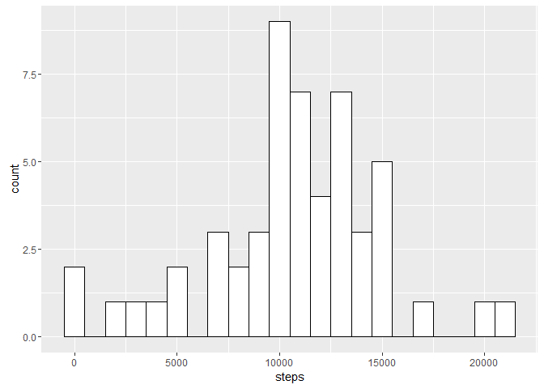
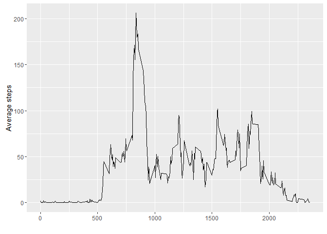
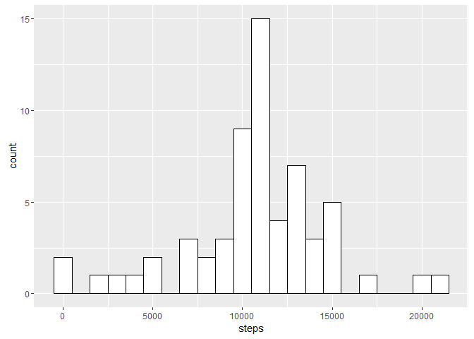
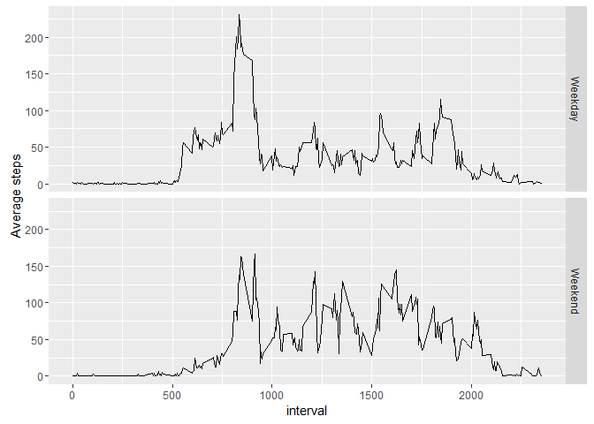

R Markdown
----------

### 1. Code for reading in the dataset and/or processing the data

``` r
setwd("C:/Users/OLKaE/Desktop/DataScienceCourse/Reproducible/Assignment1")

url <- "https://raw.githubusercontent.com/OscarLData/RepData_PeerAssessment1/master/activity.zip"
download.file(url, file.path(getwd(), "activity.zip"))
unzip("activity.zip")
activitydata <- read.csv("activity.csv" ,stringsAsFactors = FALSE)
```

### 2. Histogram of the total number of steps taken each day

``` r
dailystep <- aggregate( steps~date, activitydata, sum)
ggplot(dailystep,aes(steps))+geom_histogram(binwidth=1000,fill="white",colour="black")
```



### 3. Mean and median number of steps taken each day

``` r
paste("Mean of steps taken each day is :", round(mean(dailystep$steps),2) )
```

    ## [1] "Mean of steps taken each day is : 10766.19"

``` r
paste("Median of steps taken each day is :", median(dailystep$steps)) 
```

    ## [1] "Median of steps taken each day is : 10765"

### 4. Time series plot of the average number of steps taken

``` r
intervalmean <- aggregate( steps~interval, activitydata, mean)

ggplot(intervalmean, aes(interval, steps)) + geom_line() +
xlab("") + ylab("Average steps")
```



### 5. The 5-minute interval that, on average, contains the maximum number of steps

``` r
intervalmean[intervalmean$steps == max(intervalmean$steps,na.rm=TRUE),1]
```

    ## [1] 835

### 6. Code to describe and show a strategy for imputing missing data

``` r
sum(is.na(activitydata$steps))
```

    ## [1] 2304

``` r
missingdata <- activitydata[is.na(activitydata$steps) == TRUE,]
filledNA <- merge( x=missingdata, y=intervalmean, by="interval")[,-2]
names(filledNA)[3] <- "steps"

NewDataSet <- rbind(activitydata[is.na(activitydata$steps) == FALSE,] , filledNA[,c(3,2,1)] )
```

### 7. Histogram of the total number of steps taken each day after missing values are imputed

``` r
dailystep.NewDataSet <- aggregate( steps~date, NewDataSet, sum)
ggplot(dailystep.NewDataSet,aes(steps))+geom_histogram(binwidth=1000,fill="white",colour="black")
```



``` r
paste("Mean of steps taken each day is :", round(mean(dailystep.NewDataSet$steps),2) )
```

    ## [1] "Mean of steps taken each day is : 10766.19"

``` r
paste("Median of steps taken each day is :", median(dailystep.NewDataSet$steps)) 
```

    ## [1] "Median of steps taken each day is : 10766.1886792453"

``` r
paste("Mean is same")
```

    ## [1] "Mean is same"

``` r
paste("Median is higher because the NA data was filled the mean value by interval ")
```

    ## [1] "Median is higher because the NA data was filled the mean value by interval "

### 8. Panel plot comparing the average number of steps taken per 5-minute interval across weekdays and weekends

``` r
NewDataSet$weeklabel <- weekdays(as.Date(NewDataSet$date))
NewDataSet[!(NewDataSet$weeklabel %in% c("Saturday","Sunday")),][,4] <- "Weekday"
NewDataSet[NewDataSet$weeklabel %in% c("Saturday","Sunday"),][4] <- "Weekend"
as.factor(NewDataSet$weeklabel)
as.numeric(NewDataSet$steps)

attach(NewDataSet)
Weekday_Weekend_Average <- aggregate(steps, by=list(interval,weeklabel), mean)
names(Weekday_Weekend_Average)[1:3] = c("interval","weeklabel","steps") 
```

``` r
ggplot(Weekday_Weekend_Average, aes(interval, steps)) + geom_line() +
ylab("Average steps") + facet_grid(weeklabel ~.) 
```


